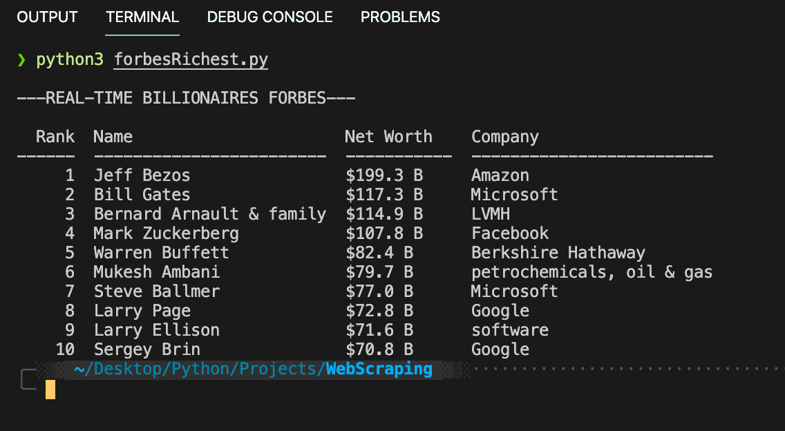

# Python / Selenium

Python Code with Selenium ,Web Scraping Forbes Realtime Billionaires and giving the result of TOP-10 from the list.



## Installation

Use the package manager [pip](https://pip.pypa.io/en/stable/) to install Selenium and Tabulate (optional).

```bash
pip3 install selenium
## If you want to formate the Data in table
pip3 install tabulate
```

You need Webdriver installed : [Download Here](https://sites.google.com/a/chromium.org/chromedriver/downloads)

```bash
# Make sure to Have Webdriver extracted at a specific path and add the path
PATH = "PATH_OF_THE_DRIVER_FILE"
driver = webdriver.Chrome(PATH)
```

## Usage

```python
from selenium import webdriver
from selenium.webdriver import ActionChains
from tabulate import tabulate
import time
```

## Contributing

Pull requests are welcome. For major changes, please open an issue first to discuss what you would like to change.

Please make sure to update tests as appropriate.

## License

[MIT](https://choosealicense.com/licenses/mit/)
